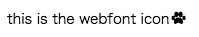

# fontIconPlayground
## setup

  you need only install webfont-icons-generator.

    $ npm install webfont-icons-generator -g

## how to do

if you want to use this svg picture as webfont icon,


use webfont-icon-generator.

    $ webfont-icons-generator -s 001_picture.svg -f originalFont -d ./fonts

webfont-icon-generator creates webfonts files.
And then you write css like below.

``` sample.css
@font-face {
  font-family: 'originalFont';
  src: url('./fonts/originalFontIcon.woff2') format('woff2');
  font-weight: normal;
  font-style: normal;
}

.testIcon {
  font: normal normal normal 14px/1 originalFont;
}

.testIcon:before {
  content: "001";
}
```

completion.



## options
```
$ webfont-icons-generator -h
usage: index.js [-h] [-c CONFIG] [-d DIST] [-f FONTNAME] [-s SRC]

Optional arguments:
  -h, --help                          Show this help message and exit.
  -c CONFIG, --config CONFIG          config json file path
  -d DIST, --dist DIST                output directory
  -f FONTNAME, --fontName FONTNAME    create webfont name and file name
  -s SRC, --src SRC                   imput svg files directory
```

you can also use config json file.
``` font.config.json
{
  "src": "./img/*.svg",
  "fontName": "originalFont",
  "dist": "./fonts"
}
```